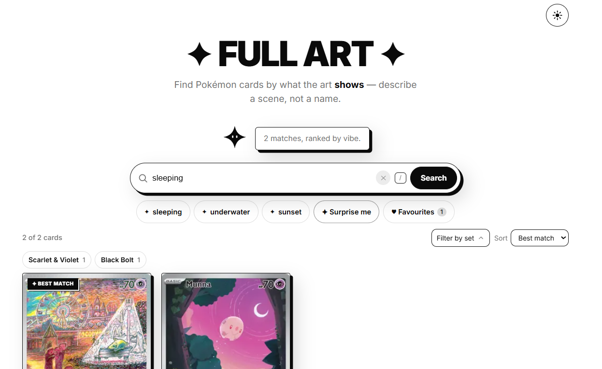
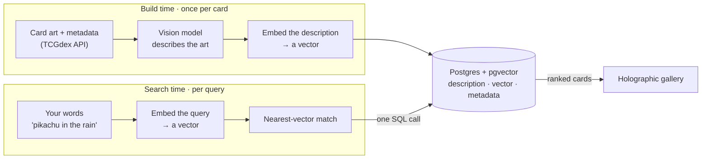
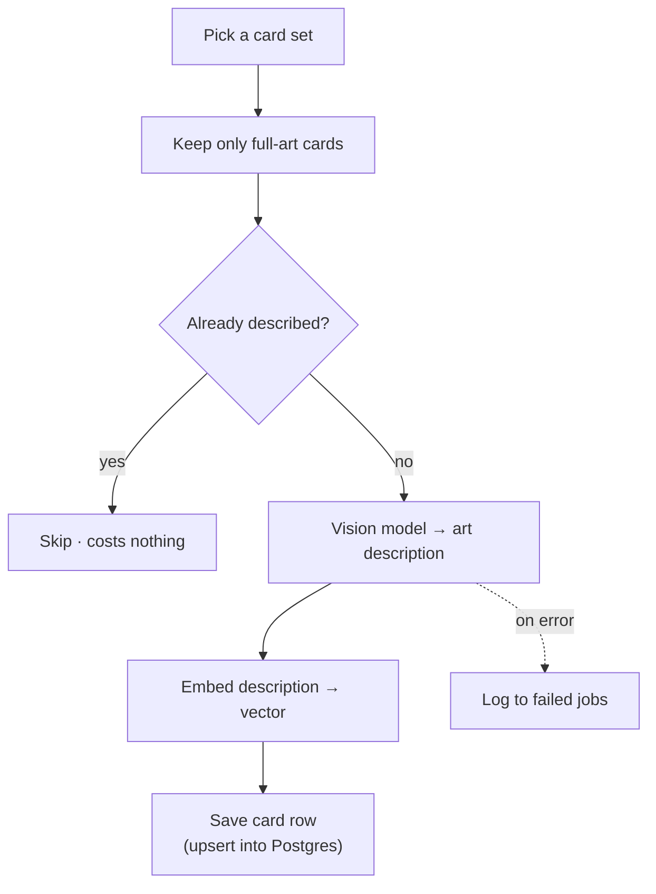
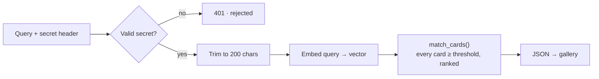
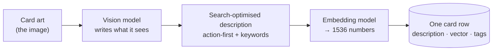
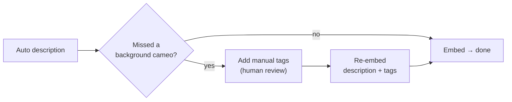

# Learning about Computer Vision ✦ a case study

This is the system behind **Full Art**, a search engine for Pokémon card *artwork*. You
describe what you want to see — *"pikachu in the rain"*, *"something sleeping"*, *"a pokemon
eating"* — and it returns the cards whose illustrations actually match.

I'm writing this for fellow engineers and the curious, not as a setup guide. It explains the
problem, the shape of the system, the decisions I made, and the trade-offs I weighed.
Diagrams carry the structure; prose explains the *why*.

> **Status ✦ launching July 2026.** This is a design write-up, not a runbook. It's a personal
> side project with nothing to hide, so I name the real tools, costs, and trade-offs
> throughout ✦ no abstraction.

---

## The problem: you can't search a picture with words

Pokémon card APIs and databases are great at metadata — name, set, rarity, the rules text. They know
nothing about what the *art* shows. So you can find every card called "Pikachu", but you
cannot find *the one where Pikachu is standing in a forest*. The picture is the whole
appeal, and it's invisible to search.

This started as a genuinely unreasonable personal quest. I'm hunting one specific card —
Detective Pikachu #098/SV-P — and somewhere down that rabbit hole I realised the problem
wasn't just mine.

Collectors build *themed* binders. We collect by all sorts of rules: a **species collection**
(one Pokémon, every card it appears on), the **michi method**, or a **vibe collection** grouped
by mood or scene — sleepy Pokémon, Pokémon eating, Pokémon in cities. Every one of those means
searching by what the art *shows*, and no card database lets you. So I built it. 💅

| Search by | What it finds | What it misses |
|---|---|---|
| Name / text *(every card database)* | "Pikachu", "Charizard", the rules text | anything about the picture |
| Art *(Full Art)* | "sleepy pokemon", "pokemon eating", "pokemon in a city" | nothing — that's the point |

> **A quick mental model.** If you've used image search, you're close: type what you want,
> get matching pictures. But Full Art doesn't compare pixels or hunt for *visually similar*
> cards. It searches a written description of each card's art ✦ so "pokemon sleeping" finds a
> snoozing Snorlax even though the word "sleeping" appears nowhere on the card.

---

## How it works, in one line

A vision model writes down what each card's art shows. That description becomes an
**embedding** — a list of numbers (a *vector*) that captures meaning, so similar things sit
close together. A search embeds your query the same way and finds the nearest descriptions.
That's the whole trick.

---

## System at a glance

The build path runs once per card; the search path runs once per query. Both share a single
store.

> **Diagram ✦ the two paths.** At build time, each card's art is described, embedded, and
> saved. At search time, your words are embedded the same way and matched against those saved
> vectors. One database serves both.

The concrete stack, all named:

- **Card data + art:** the free [TCGdex](https://tcgdex.dev) API — a public Pokémon card database, no key, no hard rate limit.
- **Orchestration:** n8n, a visual workflow engine, hosted on PikaPods.
- **Vision + embeddings:** OpenAI — `gpt-4o-mini` to describe the art, `text-embedding-3-small` to turn text into 1536-number vectors.
- **Store + search:** Supabase Postgres with `pgvector`, an extension that stores those vectors and searches them with plain SQL.
- **Front end:** an Astro + Svelte gallery, deployed on Cloudflare Pages / Vercel.

---

## Design principles and key decisions

### One store for data and vectors (pgvector, not a separate vector database)

An earlier draft paired a dedicated vector database (Pinecone) with Postgres. At this scale —
a few thousand cards — that's two services to keep in sync and a two-step search. With
`pgvector` the vector lives in the *same row* as the card's metadata, so a search is one SQL
function call that returns ranked cards directly.

| | pgvector *(chosen)* | Separate vector DB |
|---|---|---|
| Stores | vector **and** metadata in one row | vectors here, metadata elsewhere |
| A search is | one SQL call | query vectors, then look up IDs |
| To keep in sync | nothing | two stores, dual writes |
| Extra cost | none | one more paid service + key |

That one SQL call is a database function — an **RPC** (remote procedure call) named
`match_cards`. It takes a query vector and returns every card above a similarity score,
already ranked. Fewer moving parts, fewer ways to break.

### Describe once, and only pay for new cards

Describing a card costs a vision-model call, so the ingestion pipeline is **idempotent**:
re-running it changes nothing and costs nothing for work already done. A card that already has
a description is skipped before any paid call. Growing the catalogue set-by-set only ever pays
for cards it hasn't seen.

> **Diagram ✦ ingesting a set.** Keep only the cards worth indexing, skip any already
> described (free), and for each new one: describe, embed, save. Failures are logged, not
> lost.

### Return everything above a threshold, not a top-10

Full Art is meant to be a *complete* index of card art, so a search returns **every** card
scoring above a similarity threshold, ranked nearest-first — not a fixed top-10. A broad query
like "water" may return a hundred cards; a precise one, a handful.

The threshold does the filtering, not a row count. On a 0–1 similarity scale, real matches
score about 0.26–0.60 and pure nonsense tops out around 0.22, so the cut sits at ~0.2 —
slightly generous, favouring recall. Tuning relevance is a one-line change to a single SQL
function, with no app or workflow edit.

> **Diagram ✦ a search request.** Check the secret, trim the input, embed it, then ask the
> database for every card above the threshold, ranked.

---

## The vision step up close

This is the part I'm proudest of, and the reason the project exists: turning a picture into
something searchable. A vision model looks at each card and writes a description — but written
*for search*, not for humans. It's action-first, it injects the card's known name as the main
subject, and it appends a block of keywords so background details stay findable.

> **Diagram ✦ from pixels to a vector.** The image goes to the vision model, which writes a
> search-optimised description; that text is embedded into a vector and stored alongside the
> card.

### Pick the cheap model, then patch its blind spots

Both vision models miss things — small background Pokémon, "cameo" characters tucked into the
scene. Neither was clearly better. `gpt-4o-mini` spotted an Eevee that `gpt-4o` missed;
`gpt-4o` caught a Pidgey that mini missed. At four to five times the cost, the bigger model
didn't earn its price.

| Vision model | A cameo it caught | Cost / card | Verdict |
|---|---|---|---|
| `gpt-4o` | a Pidgey mini missed | ~$0.007 | not worth 4–5× |
| `gpt-4o-mini` *(chosen)* | an Eevee `gpt-4o` missed | ~$0.0015 | good enough, and cheap |

Two fixes made mini reliable enough. First, **image detail set to high**: the low setting
downsamples the art to 512px and loses exactly the small background detail that makes cameos
fun, which also caused hallucinations. High detail plus a low temperature fixed both. Second,
a lightweight human review layer: a `manual_tags` field where I add any missed cameo, then
re-embed the description *plus* the tags into a fresh vector. No second model, no schema sprawl
— just a patch path for the few cards the model fumbles.

> **Diagram ✦ the cameo patch.** Most cards embed straight from the auto description. The few
> with a missed background character get human tags added, then re-embedded.

### The ingestion pipeline in production

The diagrams above are the concept. Here's the real workflow that runs it:

The boxes are n8n nodes; the paths show data flow and the decision branches — the skip guard
that keeps re-runs free, the wait node that paces calls to dodge rate limits, the error path to
a failed-jobs table. This is the abstract pipeline above, actually running. Yay.

---

## Cost, resilience, and security

The guiding rules: ship something real fast, keep it cheap, and never let the browser hold a
secret.

- **cheap to run:** TCGdex is free, Supabase and PikaPods are already paid for, and the only real spend is a one-time vision call per card — about **$3** to describe the ~2,000 full-art cards.
- **full-art first:** I index the premium *full-art* cards (where the illustration covers the whole card) before growing set-by-set toward the full ~20,000-card catalogue. A working product in an afternoon for a few dollars beats a multi-day marathon run.
- **idempotent re-runs:** described cards are skipped, so expanding the catalogue never re-pays for old work.
- **decoupled steps:** ingestion and search are separate workflows, so a failure in one never blocks the other.
- **secret stays server-side:** the search API needs a secret header, but the browser never sees it. An Astro server route holds the secret and the database key and injects them server-side; input is capped at 200 characters. With no live backend configured, the UI falls back to bundled sample cards, so the demo always works.

### Decided against (the roads not taken)

The decisions I'm most deliberate about are the things I chose *not* to build:

- **a dedicated vector database (Pinecone):** dropped for `pgvector` ✦ one store, one query, one fewer paid service to keep in sync.
- **describing the whole catalogue up front:** deferred ✦ full-art-first ships a real product in hours; the 20,000-card run can grow set-by-set as needed.
- **user accounts for saved cards:** skipped ✦ favourites live in the browser (localStorage), so there's no login, no backend, and no per-user data to protect. The trade-off is no cross-device sync, which I'll revisit only if someone actually asks for it.

---

## What's next and current scope

Honest current state and near-term direction:

- **done:** ingestion is live and idempotent, the threshold search API is live, and the holographic gallery is wired to it — including a Tinder-style swipe on each card (♥ to save, ✕ to skip) and a client-side favourites view.
- **next:** deploy publicly (launching July 2026) and grow the catalogue set-by-set beyond the full-art subset.
- **later:** a richer manual-tags review pass for cameo-heavy cards, and set / type filters on top of the art search.

---

*Owner: Jess Klette · Last reviewed: 2026-06-25 · Review cadence: when the architecture changes
materially. This is a public case study; the build docs live in the repo.*
